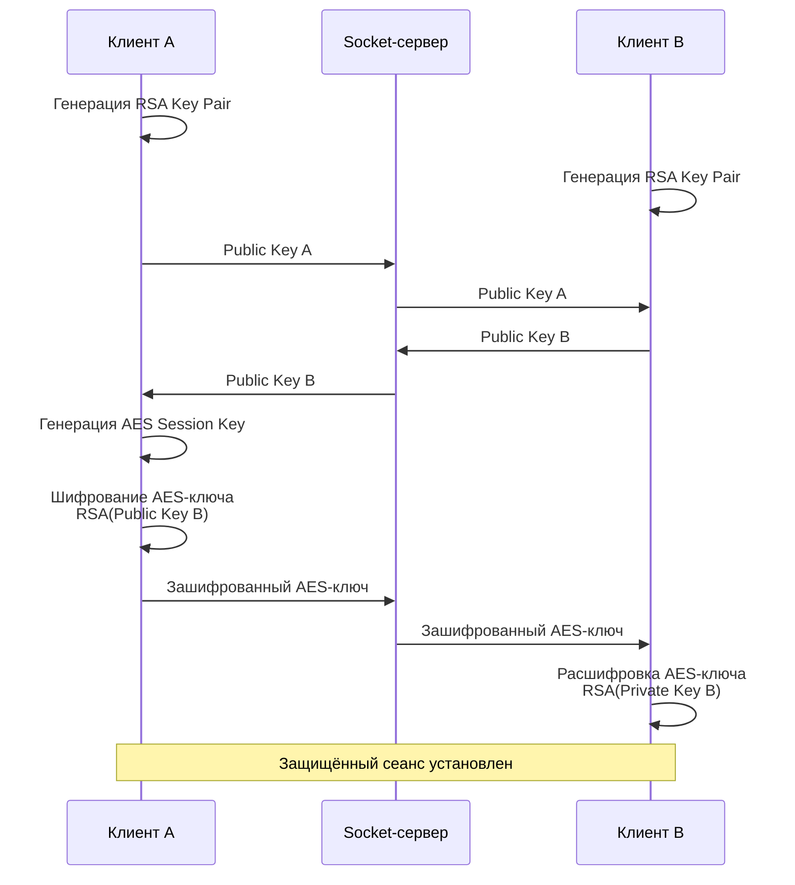
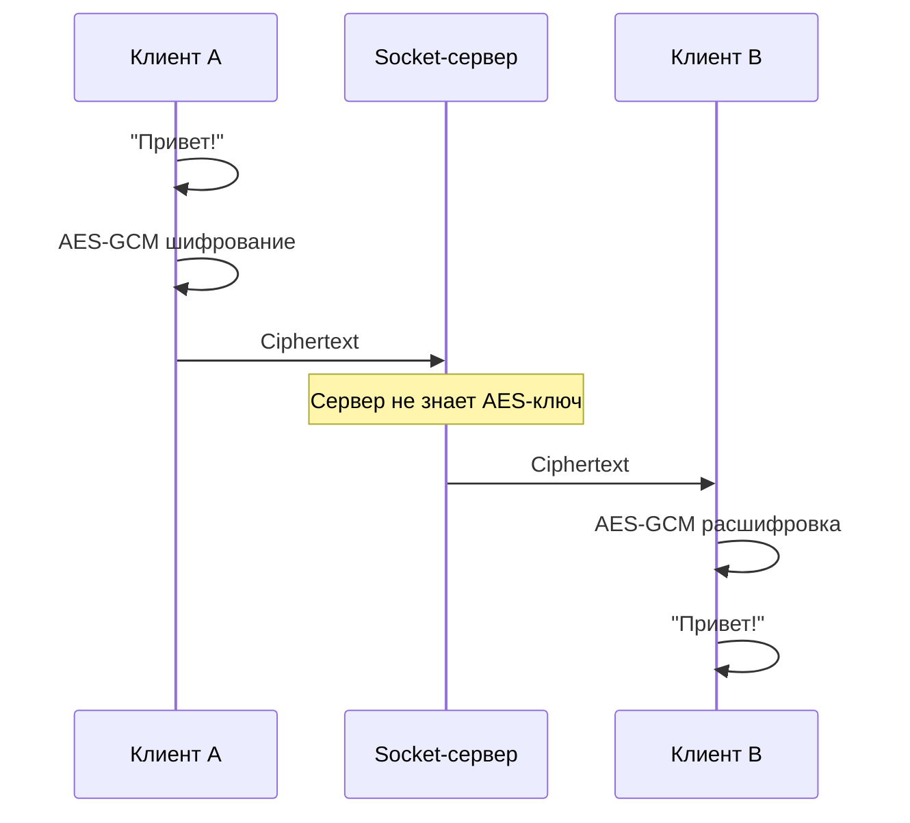

# Практическая работа 4

## End-to-end (E2E) шифрование

### Цель работы
Получить практические навыки реализации сквозного шифрования сообщений на примере простого мессенджера.

### Технические требования:
- Наличие [Docker](https://docs.docker.com/desktop/) и [Docker Compose](https://docs.docker.com/compose/install/)
- Наличие [cURL](https://curl.se/download.html) / [Postman](https://www.postman.com/downloads/) / [Insomnia](https://insomnia.rest/download)
- Современный браузер с поддержкой Web Crypto API

### Постановка задачи:
В ходе работы необходимо реализовать установление защищённого сеанса между клиентами с использованием асимметричного шифрования RSA и последующий обмен сообщениями с использованием симметричного шифрования AES.

В результате работы сервер должен передавать зашифрованные сообщения, не имея возможности получить их исходное содержимое.

### Теоретические сведения
В реальных системах сквозного шифрования обычно не используется один алгоритм для всех операций.

Асимметричные алгоритмы, такие как RSA, позволяют безопасно передать небольшой секрет между участниками, однако требуют значительно больше вычислительных ресурсов по сравнению с симметричными алгоритмами.

Симметричные алгоритмы, такие как AES, позволяют эффективно шифровать большие объёмы данных, но требуют, чтобы обе стороны предварительно получили общий секретный ключ.

Поэтому в практической работе используется комбинированный подход:

- каждый клиент генерирует собственную пару RSA-ключей;
- открытый ключ клиента передаётся другому клиенту через сервер;
- один из клиентов генерирует случайный AES-ключ для защищённого сеанса;
- AES-ключ шифруется открытым RSA-ключом второго клиента;
- зашифрованный AES-ключ передаётся через сервер;
- второй клиент расшифровывает AES-ключ своим закрытым RSA-ключом;
- после установления сеанса сообщения шифруются с использованием AES;
- сервер пересылает зашифрованные сообщения, не имея возможности расшифровать их.

Таким образом, сервер используется только как средство передачи данных между клиентами.

### Ход работы:

1. Запустите приложение при помощи команды `docker compose up -d --build`
Убедитесь, что приложение запущено корректно при помощи следующего cURL запроса

```cURL
curl --location 'http://localhost:3000/health'
```

2. Проверьте функционирование исходного приложения

Откройте две вкладки браузера со [следующим адресом](http://localhost:3000)

Отправьте сообщение из одной вкладки.
Убедитесь, что сообщение было получено второй вкладкой.

3. Проанализируйте процесс передачи сообщения

Просмотрите логи socket-сервера `docker logs chat`.
Убедитесь, что содержимое сообщения доступно socket-серверу и отображается в его логах.

Обратите внимание, что в исходной реализации socket-сервер имеет возможность прочитать содержимое передаваемого сообщения.
Это является проблемой с точки зрения сквозного шифрования: сервер должен обеспечивать передачу данных между клиентами, но не должен иметь возможности прочитать содержимое защищённого сообщения.

4. Сгенерируйте ключи клиентов

Модифицируйте файл `public/index.html`
Реализуйте автоматическую генерацию пары RSA-ключей на стороне каждого клиента:
- открытого ключа;
- закрытого ключа.

Генерация ключей должна выполняться непосредственно в браузере с использованием Web Crypto API.

Закрытый ключ не должен передаваться на сервер.
Открытый ключ должен быть доступен для передачи другим клиентам.

5. Настройте обмен открытыми ключами между клиентами

Реализуйте автоматический обмен открытыми RSA-ключами между клиентами.

При подключении клиента к socket-серверу его открытый ключ должен передаваться серверу.
Сервер должен передавать открытые ключи подключённых клиентов другим участникам соединения.
При этом сервер не должен получать закрытые ключи клиентов.

6. Установите защищенный сеанс между клиентами

После получения открытых ключей реализуйте автоматическое установление защищённого сеанса.

Для этого:
- один из клиентов, выступающий инициатором сеанса, генерирует случайный AES-ключ;
- AES-ключ шифруется открытым RSA-ключом второго клиента;
- зашифрованный AES-ключ передаётся через socket-сервер;
- второй клиент расшифровывает AES-ключ при помощи своего закрытого RSA-ключа;
- после успешного получения AES-ключа оба клиента используют его для шифрования сообщений.

Передача AES-ключа должна происходить автоматически, без ручного ввода ключей пользователем.
В результате пользователь не должен видеть и вводить криптографические ключи для работы мессенджера.

Схема работы представлена ниже


7. Зашифруйте передаваемые сообщения

После установления защищённого сеанса измените логику отправки сообщений.
Перед передачей через socket-сервер сообщение должно быть зашифровано при помощи AES.
Сервер должен получать только зашифрованные данные.

Получатель должен:
- получить зашифрованные данные;
- расшифровать их при помощи AES-ключа;
- отобразить исходное сообщение в интерфейсе.

Схема работы представлена ниже



8. Проверьте работу механизмов шифрования

Отправьте несколько сообщений между клиентами.
Убедитесь, что:
- пользователи получают исходный текст сообщений;
- в socket-сервер передаются только зашифрованные данные;
- в логах socket-сервера отсутствует исходный текст сообщений;
- закрытые RSA-ключи не передаются серверу;
- AES-ключ не передаётся в открытом виде либо в составе незашифрованных данных.

Для проверки выполните `docker logs chat` и убедитесь, что сервер не может прочитать содержание сообщений.

9. Реализуйте защиту от повторной отправки ранее перехваченного сообщения (replay attack) (опционально)

Для этого добавьте к каждому сообщению уникальный идентификатор или временную метку и реализуйте проверку получаемых сообщений на стороне клиента.
Объясните, какую проблему решает такая проверка.

### Документация:
- [Web Crypto API](https://developer.mozilla.org/en-US/docs/Web/API/Web_Crypto_API)
- [SubtleCrypto](https://developer.mozilla.org/en-US/docs/Web/API/SubtleCrypto)
- [RSA-OAEP](https://developer.mozilla.org/en-US/docs/Web/API/SubtleCrypto/encrypt#rsa-oaep)
- [AES-GCM](https://developer.mozilla.org/en-US/docs/Web/API/SubtleCrypto/encrypt#aes-gcm)

### Контрольные вопросы:
1. В чем отличие симметричного и асимметричного шифрования?
2. Почему для передачи сообщений используется симметричный алгоритм, а не RSA?
3. Для чего в данной работе используется RSA?
4. Что такое открытый и закрытый ключ?
5. Почему закрытый ключ клиента нельзя передавать через socket-сервер?
6. Как происходит установление защищённого сеанса между двумя клиентами?
7. Каким образом клиент A передаёт AES-ключ клиенту B?
8. Почему socket-сервер не может расшифровать сообщения клиентов?
9. Какие данные видит сервер при передаче зашифрованного сообщения?
10. Что произойдёт, если злоумышленник перехватит зашифрованное сообщение и повторно отправит его получателю?
11. Что такое сквозное (end-to-end) шифрование и чем оно отличается от обычного шифрования соединения?
12. Почему наличие HTTPS между клиентом и сервером само по себе не означает наличие E2E-шифрования?
13. Какие проблемы возникают, если клиент не может достоверно проверить подлинность открытого ключа другого клиента? Как в этом случае возможна атака «человек посередине» (MITM)
14. Какие дополнительные механизмы используются в реальных мессенджерах для проверки подлинности ключей и защиты от их подмены?
